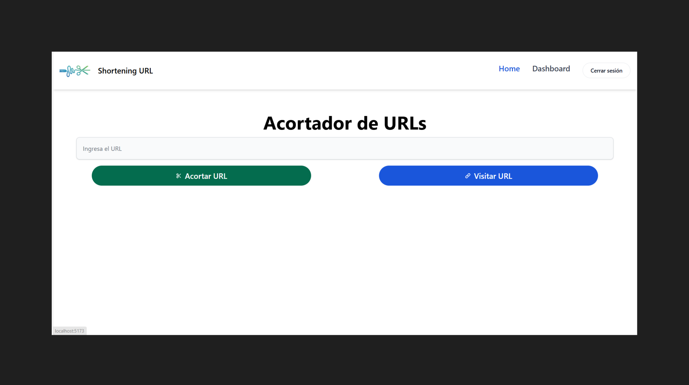
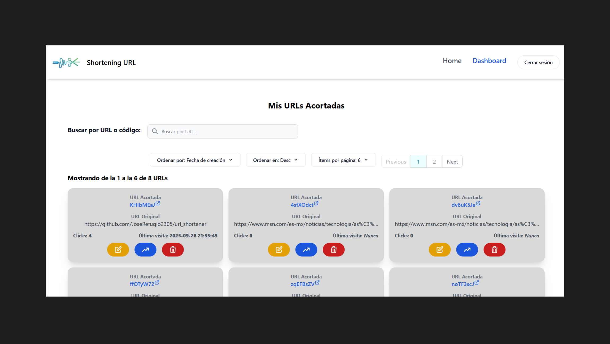

# URL Shortening Service

This is a URL shortener service, with an API developed in [Flask](https://flask.palletsprojects.com/en/stable/) and a frontend in [React JS](https://react.dev/) making use of [Vite](https://vite.dev/).

It allows user registration and login, as well as consulting, creating, updating, deleting and viewing statistics of the URLs shortened by the user.

[Click on the following image to see a video of the application running on YouTube](https://www.youtube.com/watch?v=FEa2diI2qgA)


[](https://www.youtube.com/watch?v=uGxzIu5lGfQ "Project clip")

[](https://www.youtube.com/watch?v=uGxzIu5lGfQ "Project clip")

## Table of Contents

-  [Features](#features)
-  [Getting Started](#getting-started)
   -  [API](#api)
      -  [Prerequisites](#prerequisites)
      -  [Installation](#installation)
   -  [Client](#client)
      -  [Prerequisites](#prerequisites-1)
      -  [Installation](#installation-1)
-  [Usage](#usage)
   -  [API](#api-1)
      -  [Running the application](#running-the-application)
      -  [Endpoints](#endpoints)
   -  [Client](#client-1)
      -  [Running the application](#running-the-application-1)
      -  [Routes](#routes)
-  [Technologies Used](#technologies-used)
   -  [API](#api-2)
   -  [Client](#client-2)

## Features

-  User registration and login with authentication via JWT tokens.
-  Creation, recovery, updating, deletion and obtaining statistics of shortened URLs.
-  Redirection via shortened URL

## Getting Started

These instructions will help you run the repository locally on your computer once it has been cloned.

### API

Instructions for preparing the project API developed in Flask.

#### Prerequisites

-  Python 3.8+
-  MySQL 8+ (Optional. Only if this manager was used as a database)

#### Installation

1. **Creating and activating the Python virtual environment**

   Once the repository is cloned, inside the api/ directory

   ```bash
   python3 -m venv venv
   source venv/bin/activate
   ```

2. **Install the required dependencies:**

   ```bash
   pip install -r requirements.txt
   ```

3. **Configuration of environment variables.**

   In the api/ path create the **_.env_** file with the following properties

   ```
   SECRET_KEY = secret_key
   SQLALCHEMY_DATABASE_URI = database_uri
   JWT_SECRET_KEY = jwt_secret_key
   URL_FRONT = url_from_frontend
   ENV = development_or_production
   ```

   Replace the corresponding values ​​with the ones you will use in the application.

   The frontend URL is required for CORS policy settings.

4. **Initialize the database**

   If you choose to use **MySQL** or a similar manager, you must first create a database called **urlshortener**. The tables will be automatically created based on the models when the application is first run.

### Client

Instructions for initializing the client project in React JS and Vite

#### Prerequisites

-  NodeJS 22+
-  pnpm 10+

#### Installation

1. **Instalación de dependencias.**

   Once the repository has been cloned, you need to go to the `client` directory and install the required dependencies.

   ```bash
   cd ./cilent

   pnpm install
   ```

2. **Configuration of environment variables.**

   In the `client/` path create the **_.env_** file with the following properties

   ```
   VITE_BASE_URL_PAGE= url_from_client
   VITE_API_BASE_URL_PAGE=url_from_api
   ```

   Replace the corresponding values ​​with the ones you will use in the application.

## Usage

### API

How to execute the API

#### Running the application

To start the API in Flask, run the following command:

```bash
flask run
# or
flask --app app.py run
```

To activate debug mode you must add the **`--debug`** flag to the end of the command.

The server will be available at **`http://127.0.0.1:5000`**.

***When initializing the application, the `./logs` path will be created where the application log files will be stored.***

#### Endpoints

The different endpoints of the API are documented below.

##### Authentication Endpoints

-  **[POST] `auth/register`** -> Register a new user:

   -  Request body:
      ```json
      {
         "email": "str",
         "password": "str"
      }
      ```
   -  Response body:

      code `201`

      ```json
      {
         "message": "str"
      }
      ```

-  **[POST] `auth/login`** -> User login:

   -  Request body:
      ```json
      {
         "email": "str",
         "password": "str"
      }
      ```
   -  Response body:

      code `200`

      ```json
      {
         "message": "str",
         "jwtToken": "str"
      }
      ```

##### URL Shortening Endpoints

-  **[POST] `url/shorten`** -> Shorten URL:

   -  **Headers:** `Authorization: Bearer jwt_token`
   -  Request body:
      ```json
      {
         "original_url": "HttpUrl"
      }
      ```
   -  Response body:

      code `201`

      ```json
      {
         "message": "str",
         "id": "int",
         "original_url": "str",
         "short_url": "str",
         "created_At": "str",
         "updated_At": "str"
      }
      ```

-  **[GET] `url/shorten/<url_code>`** -> Get the original url:

   -  Parameter: `url_code` is the code assigned to the shortened url
   -  Response body:

      code `200`

      ```json
      {
         "message": "str",
         "id": "int",
         "original_url": "str",
         "short_url": "str",
         "created_At": "str",
         "updated_At": "str"
      }
      ```

-  **[PUT] `url/shorten`** -> Update shortened url:

   -  **Headers:** `Authorization: Bearer jwt_token`
   -  Request body:
      ```json
      {
         "short_url": "str",
         "new_original_url": "HttpUrl"
      }
      ```
   -  Response body:

      code `200`

      ```json
      {
         "message": "str",
         "id": "int",
         "original_url": "str",
         "short_url": "str",
         "created_At": "str",
         "updated_At": "str"
      }
      ```

-  **[DELETE] `url/shorten/<url_code>`** -> Remove shortened url:

   -  **Headers:** `Authorization: Bearer jwt_token`
   -  Parameter: `url_code` is the code assigned to the shortened url
   -  Response body:

      code `204`

      ```json
      {
         "message": "str"
      }
      ```

-  **[GET] `url/shorten/stats/<url_code>`** -> Get statistics from a shortened url

   -  **Headers:** `Authorization: Bearer jwt_token`
   -  Parameter: `url_code` is the code assigned to the shortened url
   -  Response body:

      code `200`

      ```json
      {
         "message": "str",
         "id": "int",
         "original_url": "str",
         "short_url": "str",
         "created_At": "str",
         "updated_At": "str",
         "clicks": "int",
         "last_accessed_at": "str|null"
      }
      ```

### Client

How to execute the client

#### Running the application

To start the application run the following command:

```bash
pnpm run dev
```

The server will be available at **`http://localhost:5173`**.

#### Routes

-  **`/`** -> Main route where URL shortening and manual visits are carried out
-  **`/:short_url_code`** -> Route to make the request to the API service, in order to obtain the original URL and be redirected to it or display an error message if necessary.
-  **`/login`** -> Path to log in or register in the application
-  **`/dashboard`** -> Route where all the URLs shortened by the user are displayed and where you can search, edit, delete and consult URL statistics.
-  **`/*`** -> When trying to enter a non-existent route, a 404 page is displayed.

## Technologies Used

In the following section, the different technologies used in the implementation of the system will be listed.

### API

-  [Python 3.8+](https://www.python.org/)
   -  Framework [Flask](https://flask.palletsprojects.com/en/stable/)
   -  ORM [SQLAlchemy](https://www.sqlalchemy.org/)
   -  Password encryption [bcrypt](https://pypi.org/project/bcrypt/)
   -  Authentication with JWT using [Flask-JWT-Extended](https://flask-jwt-extended.readthedocs.io/en/stable/)
-  [MySQL](https://www.mysql.com/)

### Client

-  [Typescript](https://www.typescriptlang.org/)
-  [Node JS 20+](https://nodejs.org/es/)
   -  [Vite](https://vite.dev/)
   -  Framework [React JS](https://es.react.dev/)
   -  Framework CSS [TailwindCSS](https://tailwindcss.com/)
   -  UI component library [Flowbite React](https://flowbite-react.com/)
   -  HTTP Client [Axios](https://axios-http.com/es/docs/intro)
-  Package manager [pnpm](https://pnpm.io/es/)
